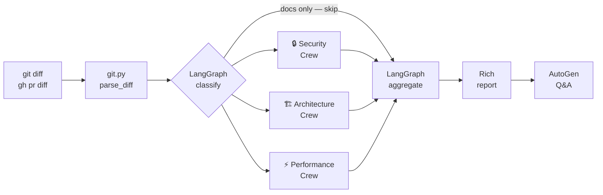

# git-crew

**AI-powered code reviewer for git diffs** — catches security vulnerabilities, architecture issues, and performance bottlenecks before they reach production.

[](https://github.com/yaseen-vm/git-crew/actions/workflows/ci.yml)
[](https://python.org)
[](LICENSE)
[](https://console.groq.com)

---

## Why git-crew?

Most static analysis tools look at your whole codebase — git-crew looks **only at what changed**. It sends the actual diff to three specialist AI crews, each focused on a different failure mode, and gives you a structured report before you push.

```
your diff  →  Security Crew  →  Architecture Crew  →  Performance Crew  →  report + Q&A
```

Three frameworks, each used for what it's uniquely good at:

| Framework | Role | Why |
|---|---|---|
| **LangGraph** | Pipeline orchestration | Stateful, conditional, streaming workflow |
| **CrewAI** | Specialist review crews | 3-agent teams produce richer findings than single-agent chains |
| **AutoGen** | Interactive Q&A after review | The only framework built for human-in-the-loop conversations |

---

## Quick Start

```bash
pip install git+https://github.com/yaseen-vm/git-crew.git
export GROQ_API_KEY=your_key_here   # free at https://console.groq.com

git-crew review                     # review staged changes
git-crew review HEAD~3..HEAD        # review last 3 commits
git-crew pr 42                      # review a GitHub PR
```

---

## Add to any GitHub repo (zero config)

Every PR gets an automatic AI review posted as a comment.

**Step 1** — Add `GROQ_API_KEY` as a repository secret.
(Settings → Secrets and variables → Actions → New repository secret)

**Step 2** — Create `.github/workflows/git-crew-review.yml`:

```yaml
name: AI Code Review
on:
  pull_request:
    types: [opened, synchronize, reopened]

jobs:
  review:
    runs-on: ubuntu-latest
    permissions:
      pull-requests: write
    steps:
      - uses: yaseen-vm/git-crew@main
        with:
          groq-api-key: ${{ secrets.GROQ_API_KEY }}
```

That's it. No server, no hosting. Uses Groq's free tier.

---

## How it works



Each CrewAI crew runs three agents in a context chain — each agent builds on the previous:

```
Security:      Auditor → Exploit Analyst → Reporter
Architecture:  Analyst → Quality Reviewer → Reporter
Performance:   Profiler → Scalability Analyst → Reporter
```

---

## What gets reviewed

| Crew | Finds |
|---|---|
| **Security** | SQL injection, hardcoded secrets, missing auth checks, `eval` on user input, `shell=True` with user data, unsafe deserialization |
| **Architecture** | SOLID violations, tight coupling, abstractions that are too deep/shallow, mixed concerns, dead code |
| **Performance** | Nested loops on collections, N+1 queries, expensive calls in hot paths, full-dataset loads, sync I/O in async contexts |

**Smart routing:**
- Docs-only diffs (`.md`, `.txt`, `.rst`) → all crews skipped
- Files with security-related paths (`auth`, `token`, `crypto`, …) → Security Crew always runs

---

## CLI reference

```bash
# Local review
git-crew review                        # staged changes
git-crew review HEAD~3..HEAD           # commit range
git-crew review main..feature          # branch diff
git-crew review --unstaged             # working-tree changes

# GitHub PR
git-crew pr 42                         # review PR
git-crew pr 42 --post-comment          # post findings as PR comment

# Output
git-crew review -o report.md           # save Markdown report
git-crew review --sarif results.sarif  # save SARIF (for GitHub Code Scanning)

# CI / hooks
git-crew review --no-interactive       # non-interactive mode
git-crew install-hook                  # install as pre-push hook
git-crew uninstall-hook                # remove hook
```

---

## LLM Providers

git-crew works with any of these providers — swap with two env vars, no code changes.

| Provider | `LLM_PROVIDER` | Key env var | Default model | Free tier |
|---|---|---|---|---|
| **Groq** (default) | `groq` | `GROQ_API_KEY` | `llama-3.3-70b-versatile` | ✅ |
| **OpenAI** | `openai` | `OPENAI_API_KEY` | `gpt-4o` | ❌ |
| **Anthropic** | `anthropic` | `ANTHROPIC_API_KEY` | `claude-3-5-sonnet-20241022` | ❌ |
| **Ollama** (local) | `ollama` | _(none)_ | `llama3.3` | ✅ |
| **Azure OpenAI** | `azure` | `AZURE_OPENAI_API_KEY` + `AZURE_OPENAI_ENDPOINT` | `gpt-4o` | ❌ |
| **Mistral** | `mistral` | `MISTRAL_API_KEY` | `mistral-large-latest` | ❌ |
| **Google (Gemini)** | `google` | `GOOGLE_API_KEY` | `gemini-2.0-flash` | ✅ |
| **OpenRouter** | `openrouter` | `OPENROUTER_API_KEY` | `openai/gpt-4o` | ✅ credits |
| **Together AI** | `together` | `TOGETHER_API_KEY` | `meta-llama/Llama-3-70b-chat-hf` | ✅ credits |

**Switch provider** — set two env vars in `.env`:
```bash
LLM_PROVIDER=anthropic
ANTHROPIC_API_KEY=sk-ant-...
```

**Override model:**
```bash
LLM_PROVIDER=openrouter
OPENROUTER_API_KEY=...
LLM_MODEL=google/gemini-2.5-pro    # any model on openrouter.ai
```

**Install the LangChain package for your provider:**
```bash
pip install "git-crew[openai]"       # openai / azure / openrouter / together
pip install "git-crew[anthropic]"
pip install "git-crew[ollama]"
pip install "git-crew[mistral]"
pip install "git-crew[google]"
pip install "git-crew[all-providers]"  # everything
```

**In GitHub Actions**, pass the provider and key to the action:
```yaml
- uses: yaseen-vm/git-crew@main
  with:
    llm-provider: 'anthropic'
    api-key: ${{ secrets.ANTHROPIC_API_KEY }}
```

---

## SARIF output — GitHub Code Scanning integration

git-crew can export findings in [SARIF 2.1.0](https://sarifweb.azurewebsites.net/) format, the same format used by CodeQL, Snyk, and Semgrep.

```bash
git-crew review --sarif results.sarif
```

Upload to GitHub Code Scanning in your workflow:

```yaml
- uses: yaseen-vm/git-crew@main
  with:
    groq-api-key: ${{ secrets.GROQ_API_KEY }}
    post-comment: 'false'

- uses: github/codeql-action/upload-sarif@v3
  with:
    sarif_file: results.sarif
```

Findings then appear in the **Security → Code scanning** tab with inline annotations.

---

## Requirements

- Python 3.11+
- `GROQ_API_KEY` — free at [console.groq.com](https://console.groq.com)
- `gh` CLI — only for `git-crew pr` and `--post-comment` ([cli.github.com](https://cli.github.com))

---

## Contributing

See [CONTRIBUTING.md](CONTRIBUTING.md). Issues and PRs are welcome.

The fastest way to add capability is a new crew — see the [Add a crew](CONTRIBUTING.md#adding-a-new-crew) guide.

---

## License

[MIT](LICENSE)
